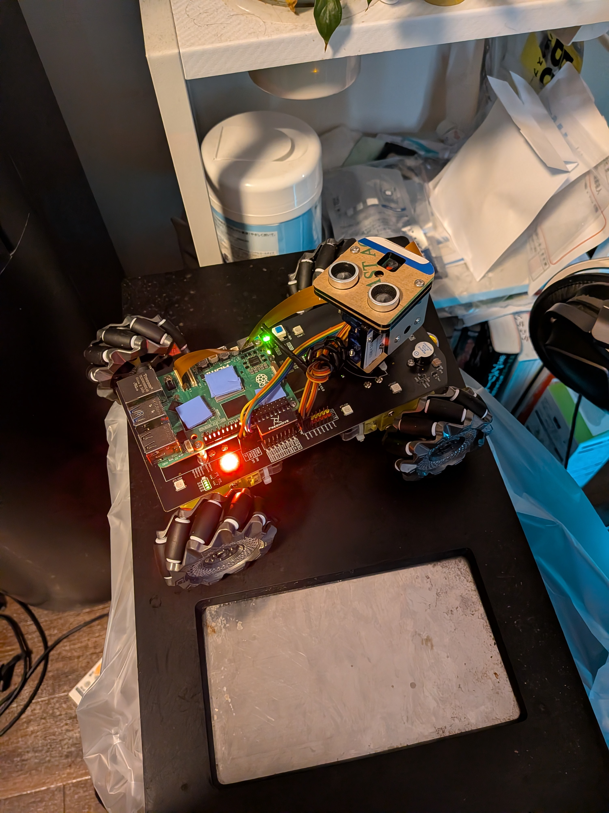
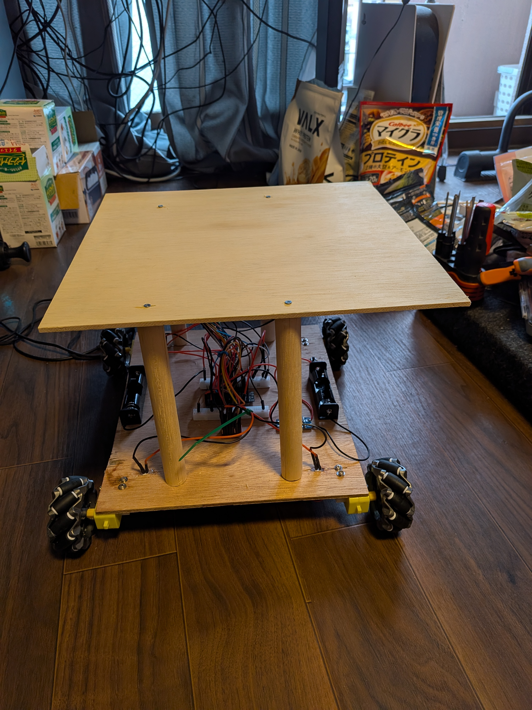

# ESP32Car

Raspberry Piで製作していたラジコンカーが故障したため、
その部品を一部流用しながら、ESP32を使用して一から製作しているロボットカーです。

## 現在の機能

- ESP32によるモーター制御
- 前進・後退・左右旋回
- OTA（Wi-Fi経由のプログラム更新）

現在は二階部分（アーム部分）の製作を進めています。

## 今後追加予定の機能

- 軽量物をつかめるロボットアーム
- 超音波センサーによる障害物回避
- Raspberry Pi 5 + カメラによるAI画像解析
- ゲームパッド・タッチパネル操作
- 複数ESP32による分散制御（ESP32-S3を司令塔として使用）

## 使用予定・使用技術

- ESP32 / ESP32-S3
- Arduino IDE
- Wi-Fi
- OTA
- Raspberry Pi 5
- AI画像解析

## 動画

https://www.youtube.com/shorts/H7LRGQXD7YQ